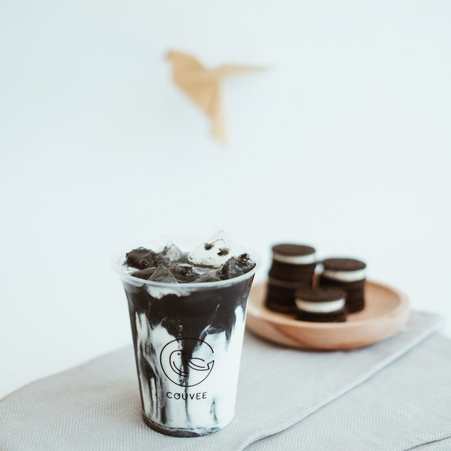
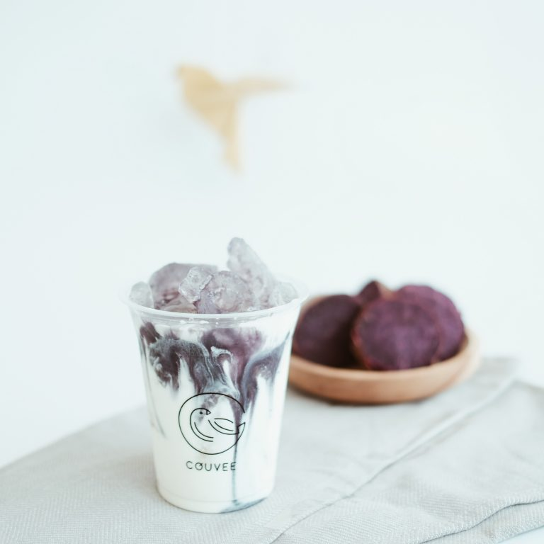

<!DOCTYPE html>
<html lang="en">
<head>
    <meta charset="UTF-8">
    <meta http-equiv="X-UA_Compatible" content="IE=edge">
    <meta name="viewport" content="width=device-width, initial-scale=1.0">
    <title>Couvee</title>
    <link rel="shortcut icon" href="https://www.couvee.co.id/wp-content/uploads/2019/08/favicon.png">
    <link rel="stylesheet" href="https://stackpath.bootstrapcdn.com/bootstrap/4.4.1/css/bootstrap.min.css" integrity="sha384-Vkoo8x4CGsO3+Hhxv8T/Q5PaXtkKtu6ug5TOeNV6gBiFeWPGFN9MuhOf23Q9Ifjh" crossorigin="anonymous">
    
    <link rel="stylesheet" href="https://cdnjs.cloudflare.com/ajax/libs/font-awesome/4.7.0/css/font-awesome.min.css">
    <link href="https://fonts.googleapis.com/css2?family=Shadows+Into+Light&display=swap" rel="stylesheet"> <!-- header -->
    <link href="https://fonts.googleapis.com/css2?family=Dancing+Script:wght@600&display=swap" rel="stylesheet"> <!-- sitata -->
    <link href="https://fonts.googleapis.com/css2?family=Homemade+Apple&display=swap" rel="stylesheet"> <!-- textp -->
    <link href="https://fonts.googleapis.com/css2?family=Syne+Mono&display=swap" rel="stylesheet"> <!-- ssh2 -->
    <link href="https://fonts.googleapis.com/css2?family=Open+Sans+Condensed:wght@300&display=swap" rel="stylesheet"> <!-- ssp -->
    <link rel="preconnect" href="https://fonts.gstatic.com">
    <link href="https://fonts.googleapis.com/css2?family=Quicksand&display=swap" rel="stylesheet">
    <link rel="stylesheet" href="css/style.css">
    <link rel="stylesheet" type="text/css" href="css/lightslider.css">
    
    
    
    
</head>
<body>

    <label for="check" id="open" onclick="openNav()">&#9776;</label>   

    

    

      <label for="check" id="openclo" onclick="closeNav()">&#x2715;</label>

      <a href="#mid" id="ab" onmouseover="big(this)" onmouseout="small(this)">about</a>
      <a href="#slider" onmouseover="big(this)" onmouseout="small(this)" >products</a>

       

      <a href="#location_page" onmouseover="big(this)" onmouseout="small(this)">location</a>
      <a href="#contact" onmouseover="big(this)" onmouseout="small(this)" id="acont">contact</a>
    

    

    

        
        
    

    

        
        

        
        
    
   
    

     
        

            
Couvee comes from the idea that everyone can enjoy coffee.  
            It doesn’t matter if you like your coffee light and sweet, or you prefer strong coffee with no sugar, you can always enjoy it with your personal preferences in here.  
            It’s our pleasure to help you find the best crafted drink that suits your taste in the best way.

        

 
    

        
        
    

    

        
        
    
  
    

        
        
    

    

        
        
    

    

        
        
    

    
    
        
 
            
<i>"A cup of coffee shared with a friend is happiness tasted and time well spent."</i>

        
  

 

    

        
        
A classic drink with chocolate cookies and vanilla cream.

    

    

        
        
Our favorite red velvet drink with cream cheese notes.

    

    

        
        
Our signature caffe latte sweetened with premium palm sugar.

    

    

        
        
Combination of purple sweet potato and creamy milk.

    

    

        
        
Creamy and leafy, the best twist of Japanese classic drink.

    

<section class="slider" id="slider">
    
<h2 id="menuh2">PRODUCTS</h2>

	<ul id="autoWidth" class="cs-hidden">
    <!--1------------------------------------>	
    <li class="item-a">
   <!--box-slider--------------->

	   

    <!--img-box---------->
    
	

	
    <!--overlayer---------->
    
	

	<!--buy-btn------>	
    <button class="buy-btn" id="blackcookie" onclick="popup1()" 
                  >See Description</button>
    

    
    

    
	<!--detail-box--------->
	

    <!--type-------->
    
	

        <h4>Black Cookie Latte</h4>
    

    
    <!--price-------->
    <h6 class="price">$23</h6>
	

	
         
	
         </li>

    <!--2------------------------------------>	
    <li class="item-b">
    <!--box-slider--------------->
        

        <!--img-box---------->
        

        
        <!--overlayer---------->
        

        <!--buy-btn------>	
        <button class="buy-btn" id="redv" onclick="popup2()">See Description</button>	
        

        

        <!--detail-box--------->
        

        <!--type-------->
        

            <h4>Red Velvet Latte</h4>
        

        
        <!--price-------->
        <h6 class="price">$25</h6>
        
 
        

         </li>
         
    <!--3------------------------------------>
    <li class="item-c">
        <!--box-slider--------------->
            

            <!--img-box---------->
            

            

            <!--overlayer---------->
            

            <!--buy-btn------>	
            <button class="buy-btn" id="melac" onclick="popup3()">+See Description</button>	
            

            

            <!--detail-box--------->
            

            <!--type-------->
            

                <h4>Melacca</h4>
            

            
            <!--price-------->
            <h6 class="price">$24</h6>
            
 
            

        </li>

    <!--4------------------------------------>
    <li class="item-d" id="itemd">
    <!--box-slider--------------->
        

        <!--img-box---------->
        

        

        <!--overlayer---------->
        

        <!--buy-btn------>	
        <button class="buy-btn" id="taro" onclick="popup4()" >+See Description</button>
        

        

        <!--detail-box--------->
        

        <!--type-------->
        

            <h4>Taro Latte</h4>
        

        
        <!--price-------->
        <h6 class="price">$22</h6>
        
 
        

    </li>

    <!--5------------------------------------>
    <li class="item-e">
            <!--box-slider--------------->
        

                <!--img-box---------->
            

                
        
                <!--overlayer---------->
                

                <!--buy-btn------>	
                <button class="buy-btn" id="matcha" onclick="popup5()">+See Description</button>	
                

            

        
                <!--detail-box--------->
                

                <!--type-------->
                

                    <h4>Matcha Latte</h4>
                

                
                <!--price-------->
                <h6 class="price">$24</h6>
                
 

        

    </li>

    </ul>
</section>

    

        

            
You can found us in Yogyakarta. Every store has their own unique ambience, let’s click All Locations below to know which one is gonna be your favorite!

        

        

            <a href="#location_page" class="fa" id="butt2">ALL LOCATIONS  &#xf175;</a>
        

    

    

        

            
        

        

            
        

    

 

    

        <h3>ALL LOCATIONS</h3>
    

    

    

        

            
        

        

            <h6>Jl Seturan, Yogyakarta</h6>  
            
 <spann style="color: rgb(155, 155, 155);"> &#xf08d;</spann> Jl. Seturan Raya No.88, Kledokan, Caturtunggal, Kec. Depok, Kabupaten Sleman, Yogyakarta 
 
            
 <spann style="color: rgb(155, 155, 155);"> &#xf017;</spann>  Opens at <b>09.00 AM - 12.00 AM</b>
 
            <a href="https://www.google.com/maps/place/Couvee+-+Seturan/@-7.7718389,110.4073637,17z/data=!3m1!4b1!4m5!3m4!1s0x2e7a590e156f7c1f:0x2502cff3b7310971!8m2!3d-7.7717774!4d110.4095386" id="map_btn">GET DIRECTION</a>
        

    

    

        

            
        

        

            <h6>Jl Kaliurang, Yogyakarta</h6>  
            
 <spann style="color: rgb(155, 155, 155);"> &#xf08d;</spann>  Jalan Kaliurang Km 5.2, Manggung, Caturtunggal, Depok, Sleman, DIY 55281
 
            
 <spann style="color: rgb(155, 155, 155);"> &#xf017;</spann>  Opens at <b>08.00 AM - 12.00 AM</b>
  
            <a href="https://www.google.com/maps/place/Couvee+-+Jalan+Kaliurang/@-7.7588019,110.3792548,17z/data=!3m1!4b1!4m5!3m4!1s0x2e7a59ac8cfe7685:0xda4257bfd1fb71da!8m2!3d-7.7588019!4d110.3814435" id="map_btn">GET DIRECTION</a>
        

    

    

    

    

        

            
        

        

            <h6>Jl Ahmad Dahlan, Yogyakarta</h6>  
            
 <spann style="color: rgb(155, 155, 155);"> &#xf08d;</spann>  Jl. KH. Ahmad Dahlan No.98, Notoprajan, Ngampilan, Yogyakarta
 
            
 <spann style="color: rgb(155, 155, 155);"> &#xf017;</spann>  Opens at <b>09.00 AM - 12.00 AM</b>
 
            <a href="https://www.google.com/maps/place/Couvee+-+Ahmad+Dahlan/@-7.8009865,110.3564587,17z/data=!3m1!4b1!4m5!3m4!1s0x2e7a57626f42dd41:0xa1a979f98e9aabcc!8m2!3d-7.8011084!4d110.3585764" id="map_btn">GET DIRECTION</a>
        

    

    

    

    

        <form class="needs-validation">
        <h1 id="shh2">Say Hello!</h1>
        
Send us a message and we’ll get back to you as soon as possible. Looking forward to hearing from you! 

        
        

             <label id="labn" for="name">Name</label>  
             <input id="name" type="text" class="form-control" name = "name" placeholder="Enter your name" required>
        

        

             <label id="labe" for="email">Email</label>  
             <input id="email" type="email" class="form-control" name = "email" placeholder="Enter your email" required >
        

     
        

            <label id="labm" for="mes">Message</label> 
            <input id="mes" type="text" class="form-control" name = "message" placeholder="Enter your message" required>
        

    
        

             <button id="but2" class="btn">Send Message</button> 
        

      </form>
    

    

        
         
        <h2 id="find_h2">FIND US ON INSTAGRAM!</h2>
    

    

    

        

            

                
            

            

                

                    <h5>LINKS</h5>
                

                

                    <a href="#header">Homepage</a>
                    <a href="#mid">About us</a>
                    <a href="#slider">Menu</a>
                    <a href="#location_page">Location</a>
                    <a href="#contact">Contact</a>
                

            

            

                

                    <h5>CONTACTS</h5>
                

                

                    
&#xf003; Hello@couvee.co.id

                    
&#xf095; Phone num

                

            

            

                

                    <h5>SOCIALS</h5>
                

                

                    <a href="https://www.instagram.com/couvee.idn/" class="fa">&#xf16d; couvee.idn </a>
                

            

        

    

    

        

            
© 2019 Couvee

        

        
    

    
</body>
</html>
